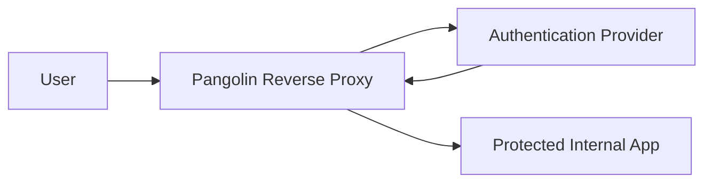

# Pangolin – Secure Self-Hosted Reverse Proxy with Identity and Access Control

Managing secure access to internal applications has always been a challenge for developers, sysadmins, and DevOps teams. Enter **Pangolin** – a secure, self-hosted reverse proxy that comes with **built-in Identity and Access Management (IAM)**.

Whether you're looking to protect internal dashboards, developer tools, or SaaS applications, Pangolin offers a modern, efficient, and privacy-focused solution.

---

## 🚀 What is Pangolin?

**Pangolin** is an **open-source reverse proxy** built with a security-first mindset. Unlike traditional reverse proxies that rely on external tools for authentication and authorization, Pangolin integrates these capabilities natively.

### 🔑 Key Features

- 🔐 Built-in Authentication (Google, GitHub, OIDC, SAML, LDAP, etc.)
- 🛡️ Access Control Rules (per app, user, group, etc.)
- 🖥️ Modern Web UI for configuration
- 🧠 Single Sign-On (SSO) support
- 🌍 Self-hosted – full control over your data
- 📦 Lightweight and Docker-ready

---

## 🧩 Why Choose Pangolin?

Setting up identity and access management across multiple services often requires complex integrations. Pangolin simplifies this by **bringing identity directly into the proxy**.

### Perfect for:

- Internal tools like Grafana, Prometheus, Jenkins, etc.
- Admin dashboards and internal SaaS portals
- Microservices needing centralized access control
- Teams requiring SSO and audit logging

---

## 🏗️ How Pangolin Works

Pangolin sits in front of your services as a **reverse proxy with identity-aware access**. Users are prompted to authenticate, and access is granted based on your configuration.

---

## ⚙️ Features Overview

| Feature                      | Description                                                                |
|-----------------------------|----------------------------------------------------------------------------|
| 🔐 Authentication           | Supports OIDC, OAuth2, LDAP, SAML, and more                                |
| 👥 Role-Based Access        | Fine-grained access control by user, email, or group                        |
| 🖼️ Web UI                   | Configure apps and rules visually                                           |
| 📜 Audit Logging            | Log who accessed what and when                                             |
| 🧾 Policy Management        | YAML-based configuration or UI-driven                                      |
| 📦 Easy Deployment          | Docker and Kubernetes compatible                                           |
| 🌍 Multi-Tenant Support     | Separate IAM policies per app or tenant                                    |

---

## 🆚 Pangolin vs Other Reverse Proxies

| Feature                         | **Pangolin**  | **OAuth2-Proxy** | **Authelia**     | **Traefik Forward Auth** |
|----------------------------------|---------------|------------------|------------------|---------------------------|
| Authentication Built-in         | ✅ Yes        | ❌ External       | ✅ Yes           | ❌ External               |
| Web UI for Config               | ✅ Yes        | ❌ No            | ✅ Yes           | ❌ No                     |
| Role-Based Access Control       | ✅ Built-in   | ⚠️ Limited       | ✅ Yes           | ❌ No                     |
| Multi-Provider Auth Support     | ✅ Yes        | ✅ Yes           | ✅ Yes           | ✅ Yes                    |
| Single Binary Deployment        | ✅ Yes        | ✅ Yes           | ⚠️ Complex       | ✅ Yes                    |
| Docker Support                  | ✅ Official   | ✅ Official      | ✅ Official       | ✅ Official               |
| Complexity                      | ⭐ Low        | ⭐⭐ Medium        | ⭐⭐⭐ High         | ⭐⭐ Medium                |

---

## 🔧 Deploy Pangolin with OctaByte

Want to use **Pangolin** without dealing with servers, SSL, or configs?

### OctaByte offers:

- 🚀 One-click Pangolin deployment
- 🔒 Free SSL certificates
- 🛡️ Security hardening
- 💾 Automated backups
- 🧑‍💼 24/7 support
- ☁️ Dedicated Virtual Machines

We handle everything. You focus on your applications.

---

## 📦 Real-World Use Cases

- **Startups** protecting dev tools with GitHub login
- **Agencies** offering secure client dashboards
- **Enterprises** managing microservices access via RBAC
- **Education** platforms restricting internal apps to staff

---

## 🌐 Resources

- 🔗 [Pangolin GitHub](https://github.com/pangolinproxy/pangolin)
- 📚 [Documentation](https://docs.pangolinproxy.com/)
- ☁️ [Deploy with OctaByte](https://octabyte.io)

---

## 📣 Final Thoughts

**Pangolin** is an all-in-one reverse proxy and identity solution that’s **easy to deploy, secure by design**, and flexible for real-world teams.

Whether you're a solo dev or running an enterprise infrastructure — Pangolin provides **SSO, IAM, and reverse proxy capabilities in one simple stack**.

> Let **OctaByte** deploy Pangolin for you — fast, secure, and managed.

