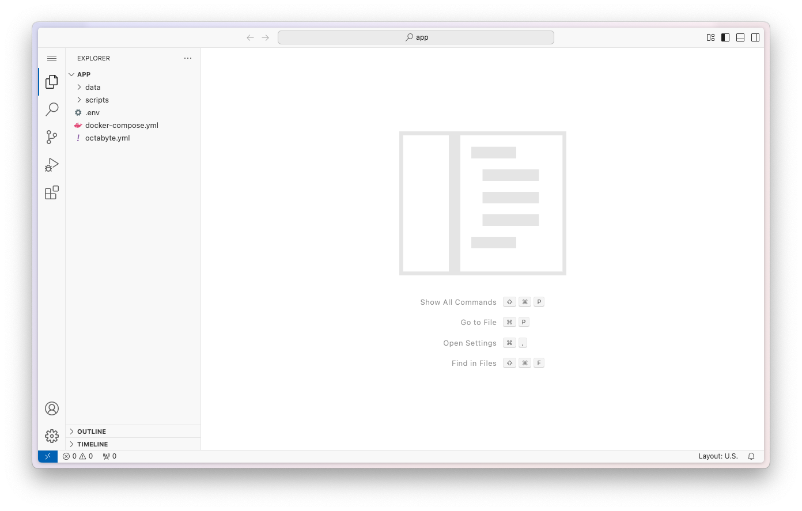
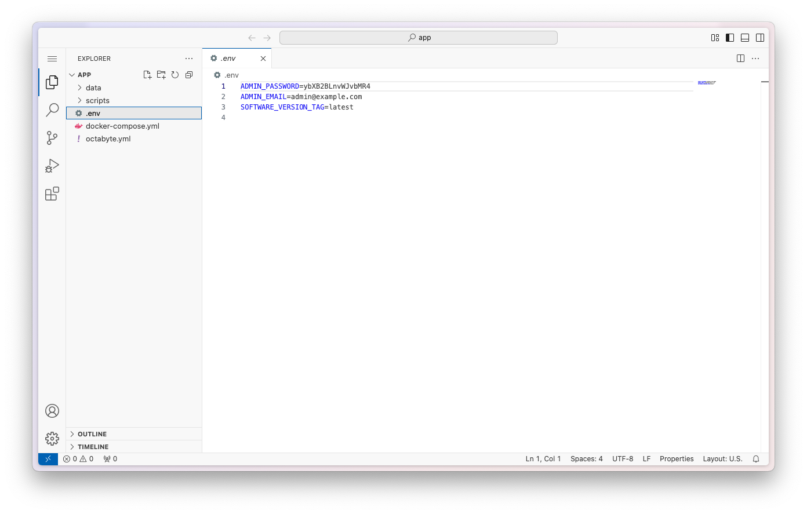
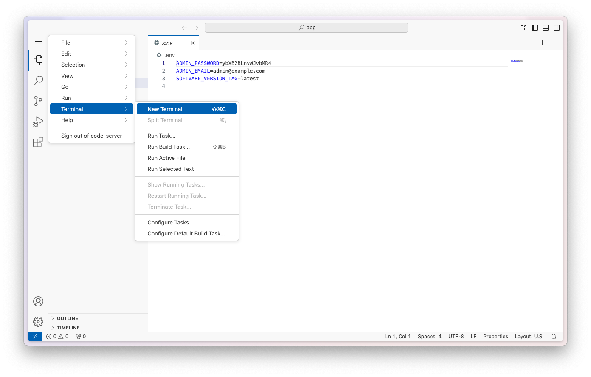
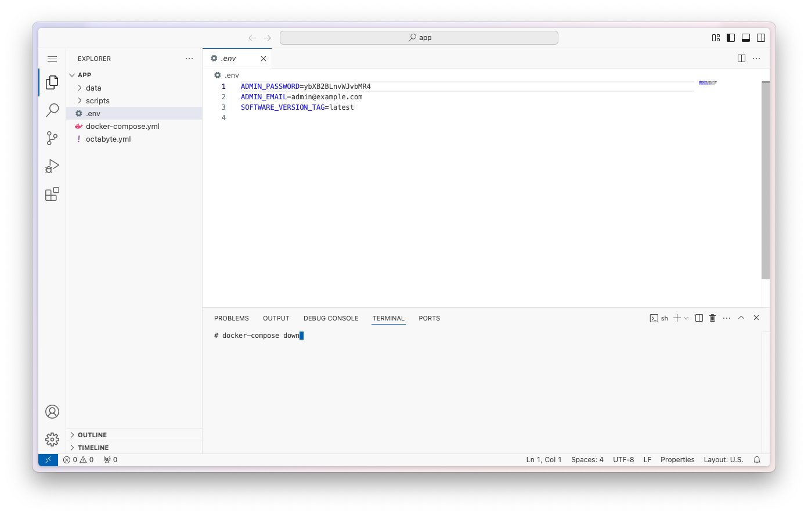

At OctaByte, we make it simple for you to manage your virtual machines. Whether you want to tweak environment variables or restart your app, this guide walks you through each step with images to help you along the way.

---

## Step 1: Request Access to Your Server

To get started, request access to your server. You can contact our support team in two ways:

- **Email:** [support@octabyte.io](mailto:support@octabyte.io)  
- **Live Chat:** Available on [octabyte.io](https://octabyte.io)

---

## Step 2: Receive Email with Credentials

Our support team will email you the login credentials you need to access your server.

---

## Step 3: Log in to Your Server

Use the provided credentials to log in to your server. You'll land in your workspace where you can view and manage files.

---

## Step 4: Navigate the File System

On the left-hand side, you’ll find the file explorer. You can switch between directories and locate the files you need to modify.



---

## Step 5: Edit the `.env` File

To update environment variables, open the `.env` file. You can add or modify values as needed.



---

## Step 6: Open the Terminal

After saving changes to the `.env` file, open the terminal from the dashboard to apply the updates.



---

## Step 7: Restart Your App

Run the following two commands in the terminal to restart your Docker-based application:

```bash
docker-compose down
docker-compose up -d
```

This will gracefully restart your app with the updated environment variables.



## Step 8: You're Done!

That’s it! Your app is now running with the updated settings. If you run into any issues, don’t hesitate to reach out to our support team.

Need help? Reach us anytime at support@octabyte.io or through live chat on [octabyte.io](https://octabyte.io)